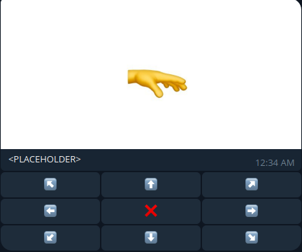

# Flood captcha bot

Simple telegram bot example written using aiogram with captcha to stop spam.

## Environment

To use this example set `.env` file with:

`BOT_TOKEN` set to token given to the bot by @BotFather

## Storage

For this example bot uses MemoryStorage which is **not** recommended for use in production

> Learn more [about storages in aiogram](https://docs.aiogram.dev/en/latest/dispatcher/finite_state_machine/storages.html)

## Captcha example

Currently this captcha is being used by [@paces_bot](https://t.me/paces_bot)

## Using

* aiogram 3.13.1
* python 3.11.8 (recommended)